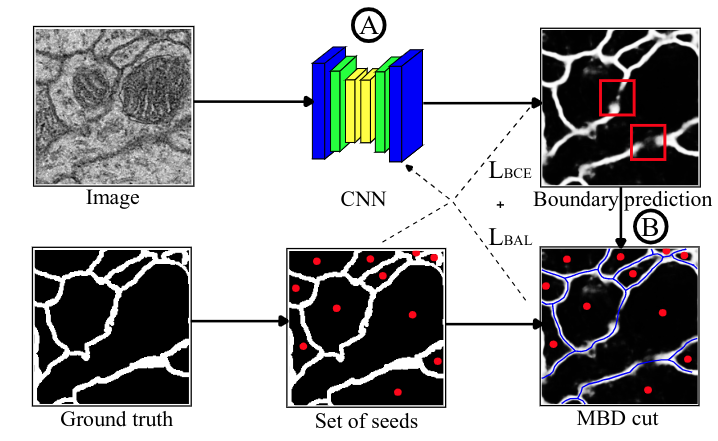
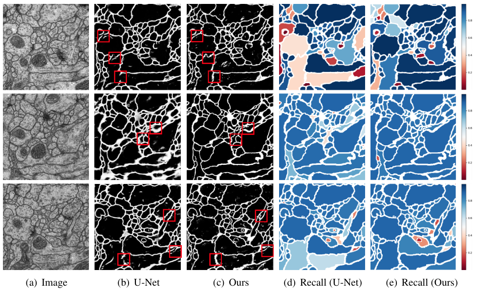

# Introducing the Boundary-Aware loss for deep image segmentation

Official github repo. for BMVC 2021

Authors: Minh Ôn Vũ Ngọc, Yizi Chen et al.

## Abstract

Most contemporary supervised image segmentation methods do not preserve the initial topology of the given input (like the closeness of the contours). One can generally remark that edge points have been inserted or removed when the binary prediction and the ground truth are compared. This can be critical when accurate localization of multiple interconnected objects is required. In this paper, we present a new loss function, called, **Boundary-Aware loss** (BALoss), based on the **Minimum Barrier Distance** (MBD) cut algorithm. It is able to locate what we call the **leakage pixels** and to encode the boundary information coming from the given ground truth. Thanks to this adapted loss, we are able to significantly refine the quality of the predicted boundaries during the learning procedure. Furthermore, our loss function is differentiable and can be applied to any kind of neural network used in image processing. We apply this loss function on the standard U-Net and DC U-Net on Electron Microscopy datasets. They are well-known to be challenging due to their high noise level and to the close or even connected objects covering the image space. Our segmentation performance, in terms of Variation of Information (VOI) and Adapted Rank Index (ARI), are very promising and lead to ~15% better scores of VOI and ~5% better scores of ARI than the state-of-the-art.

## Our Proposed pipeline



## Visualize results



## How to use this loss

Compile the loss:
```bash
python setup.py build
python setup.py install
```

A short demo is also available in BALoss/demo.py:
```bash
python demo.py
```

## Some examples are given in this folder:
https://drive.google.com/drive/folders/1ue2Eq_UGzY-21v7gUHVlhFIppn-orJFw?usp=sharing
